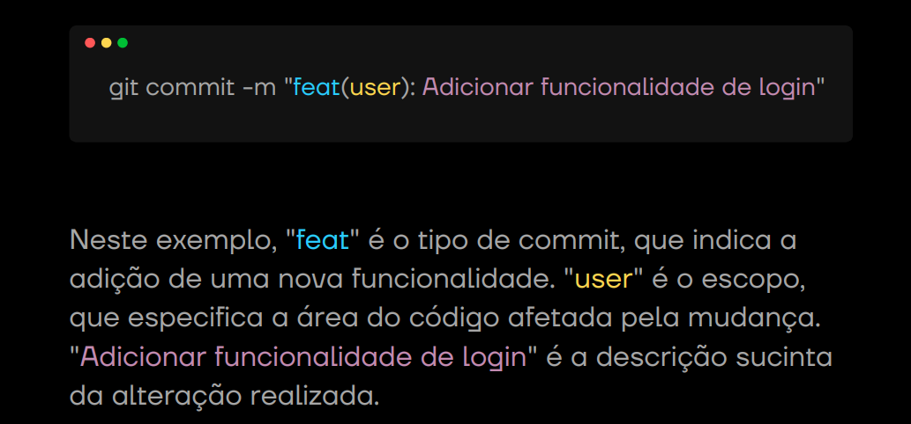
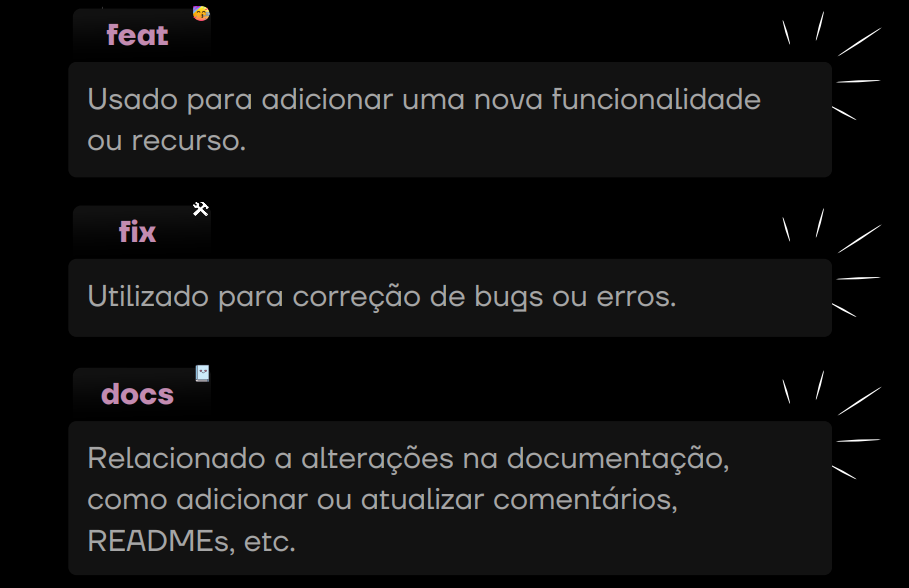
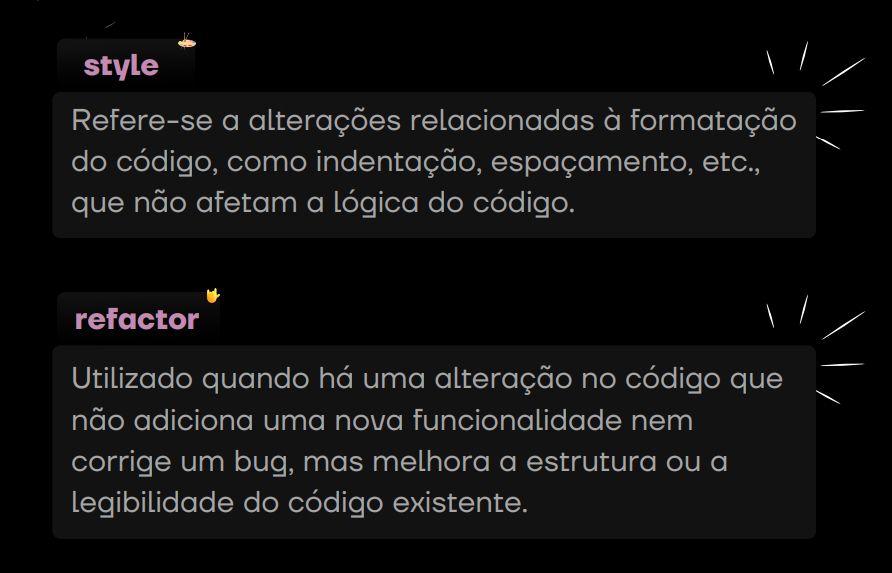
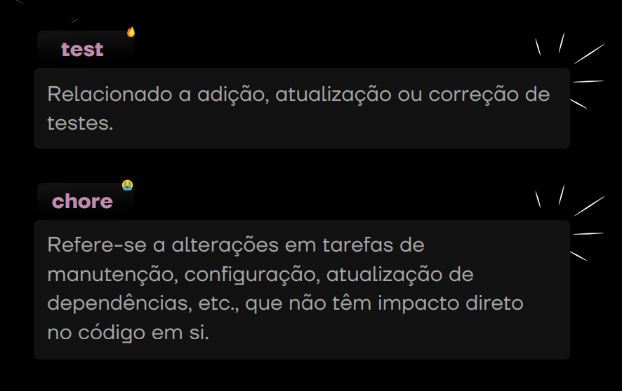
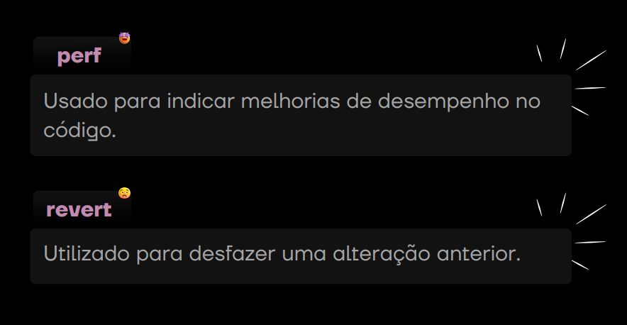
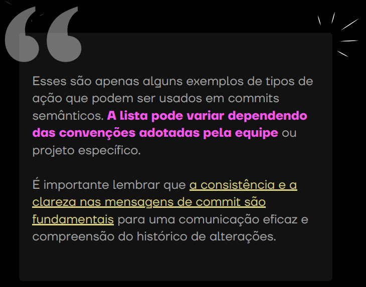

<h1 align="center"> >_ How to Create Commits Semantics </h1>

 

## >_ What are Semantic commits?

Commits Semânticos são uma abordagem padronizada
para escrever mensagens de commit em sistemas de
controle de versão.  
Eles seguem uma convenção específica, como o
"Conventional Commits"
, que inclui um formato
predefinido para descrever claramente o tipo de
alteração, o escopo e uma breve descrição do que foi
modificado.  
Essa prática ajuda a tornar o histórico de alterações
mais legível, facilitando a compreensão das mudanças
feitas em um projeto ao longo do tempo.

### Exemplo prático: 

  

## >_ The most common actions:

  

  

  

  

  

